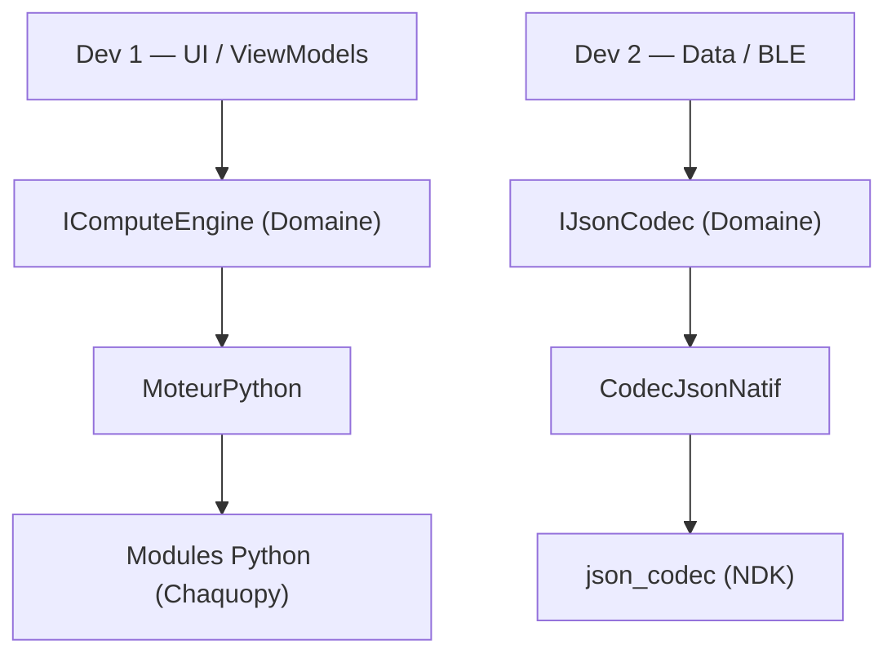
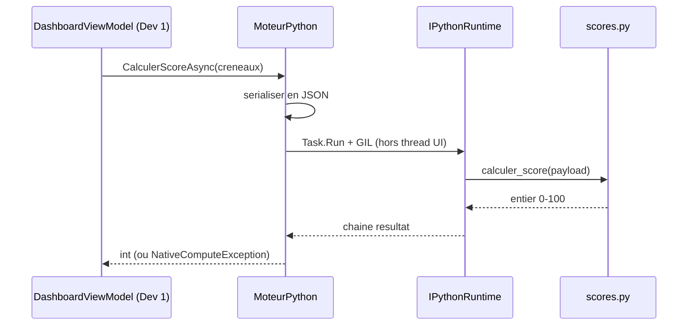
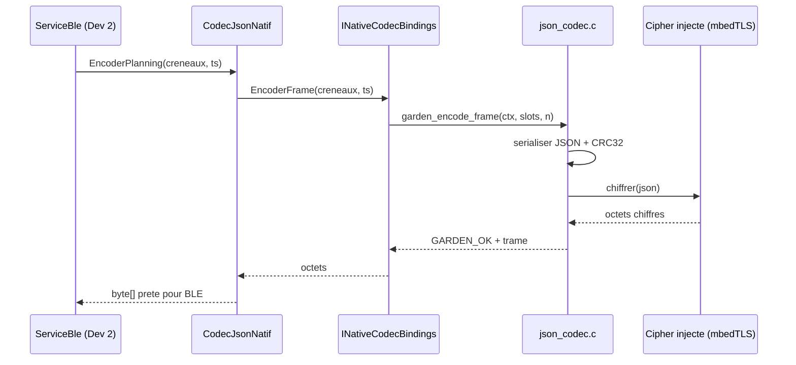
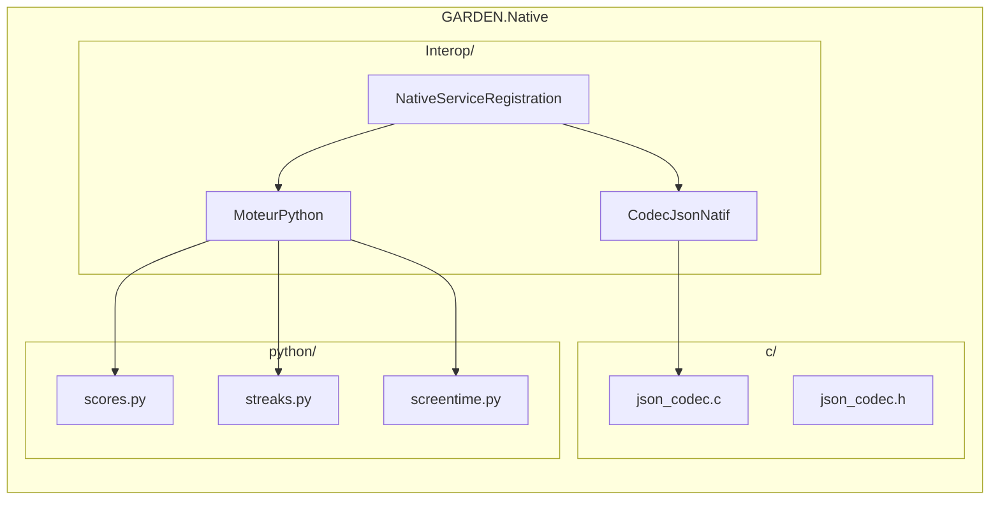

# Architecture — Couche Native GARDEN (Dev 3)

## Vue d'ensemble

La couche Native expose deux capacités derrière deux interfaces de Domaine.
Les couches UI (Dev 1) et Data (Dev 2) dépendent des **abstractions**, jamais
des implémentations concrètes — inversion de dépendance stricte.

## Flux d'un calcul de score

## Flux d'émission d'une trame BLE

## Frontières et découplage

Les trois sous-modules (`python/`, `c/`, `Interop/`) ne dépendent pas les uns
des autres : `scores.py` ignore `json_codec.c`, et réciproquement. Cette
indépendance autorise un développement et des tests en parallèle.

## Risques principaux

1. **Format JSON ESP32 non figé** — bloque `c/` ; à valider avec le firmware.
2. **GIL Chaquopy** — résolu par `Task.Run` + `SemaphoreSlim` (hors thread UI).
3. **Sécurité mémoire C** — écritures bornées, réentrant, validé ASan/UBSan.
4. **Cold start Chaquopy** — `InitialiserAsync()` depuis le SplashView.
5. **Crash inter-langage** — toute erreur convertie en exception C# typée.
6. **Clé AES** — injectée (Keystore), jamais codée en dur.

## Stratégie de test

- **Python** : `unittest`/`pytest`, sur PC, sans Android (boucle rapide).
- **C** : harnais autonome + AddressSanitizer/UBSan (et Valgrind en CI).
- **C# Interop** : xUnit avec faux `IPythonRuntime` / `INativeCodecBindings`
  (hôte), puis tests instrumentés sur émulateur API 26+.
- **Régression de trame** : golden file comparant la sortie binaire à une
  trame de référence, une fois le format ESP32 figé.
